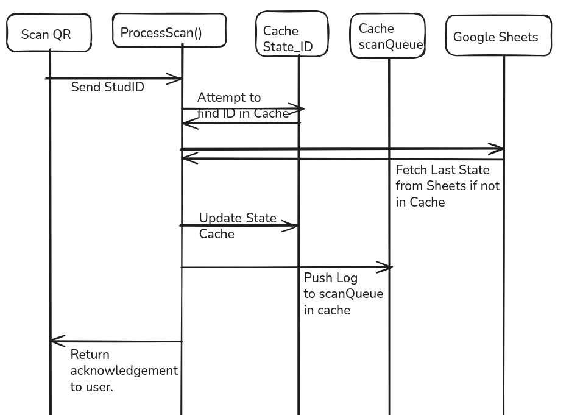
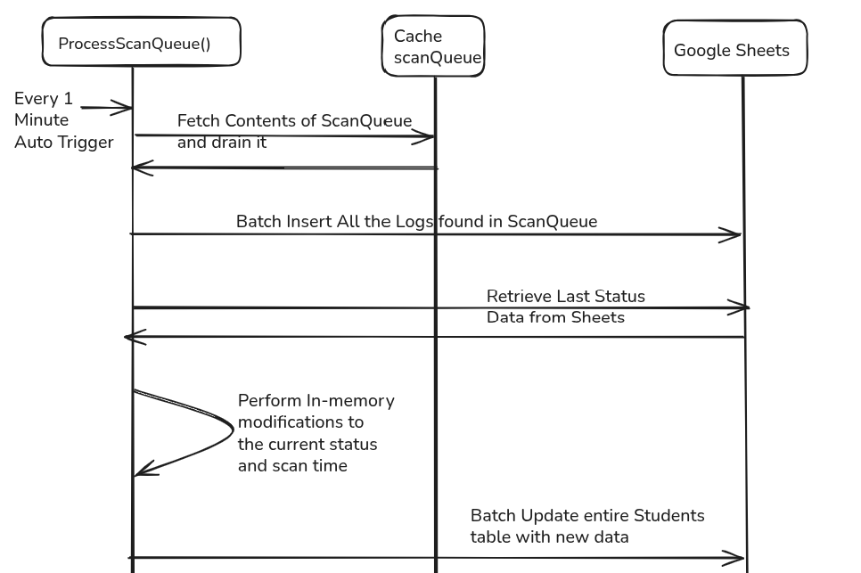

# Entry-Exit Logger

A robust, web-based application designed to reliably track and log student entries and exits in real-time. Built on Google Apps Script and using Google Sheets as a database, the system features a dedicated scanning interface and admin dashboards for streamlined student management.

Submission by Anish Goenka, Email : anikavy.goenka@gmail.com

## Features

- **Quick Scanning Interface**: A responsive UI (`Scanner.html`) to process student IDs rapidly.
- **Real-Time Database Logging**: Records timestamps, statuses, and student details instantly to Google Sheets.
- **Admin Dashboard**: Interfaces to manage the student roster (`AddStudent.html`, `Students.html`) and oversee logs (`Admin.html`).
- **Concurrency Safety**: Utilizes strict resource locking to handle simultaneous scans across multiple devices without data loss.
- **High Performance**: Leverages caching to reduce database read overhead, ensuring rapid scan feedback and preventing API quota exhaustion.

## Usage

- **Create a Student**: Navigate to the [Add Student dashboard](https://script.google.com/a/macros/kiit.ac.in/s/AKfycbyY4ZqmOUb0BRoqFOEmJzWMRmaILb6H6VQG0IokaFKagavQgx3cdXvSSJ5tCMC8Te5J/exec?role=admin&route=add-student) to create a student account and copy their QR Code link.
- **View Students & QR Codes**: If you missed the QR link, retrieve it from the [Students List](https://script.google.com/a/macros/kiit.ac.in/s/AKfycbyY4ZqmOUb0BRoqFOEmJzWMRmaILb6H6VQG0IokaFKagavQgx3cdXvSSJ5tCMC8Te5J/exec?role=admin&route=students).
- **Scanner Access**: Navigate to the [Main Web App](https://script.google.com/macros/s/AKfycbyY4ZqmOUb0BRoqFOEmJzWMRmaILb6H6VQG0IokaFKagavQgx3cdXvSSJ5tCMC8Te5J/exec) and click the "Open Scanner" button to begin scanning.
- **View Logs**: Verify entry logging securely via the [Admin Logs dashboard](https://script.google.com/a/macros/kiit.ac.in/s/AKfycbyY4ZqmOUb0BRoqFOEmJzWMRmaILb6H6VQG0IokaFKagavQgx3cdXvSSJ5tCMC8Te5J/exec?role=admin&route=logs).
- **Raw Database Access**: View the actual [Raw Spreadsheet Database](https://docs.google.com/spreadsheets/d/1Rouh3igN8H18hAaNZkPmIdqd3yTJxYb7ZDKjUMWP3mA/edit?usp=sharing).
- **QR Code Directory**: Access all generated QR assets in the [Drive Folder](https://drive.google.com/drive/folders/1dJda8_Ksj3AHfyXSVM-eeiPNYmZMRXjU?usp=sharing).

## Application Flows

### 1. Scanning and Logging Flow
This is the core flow executed by staff or automated scanners at entry/exit checkpoints.

*Figure 1: Sequence diagram illustrating instantaneous caching and queuing during a scan.*

1. **Scan Event**: A student's ID (e.g., barcode or QR) is scanned on the `Scanner.html` interface.
2. **Validation & Lookup**: The system attempts to resolve the ID to a known student record using the high-speed cache.
3. **Concurrency Lock**: The system acquires a lock before altering the state to guarantee data integrity.
4. **State Resolution**: The script calculates the student's *last known state* (Inside vs. Outside) to determine if this scan represents an "Entry" or an "Exit".
5. **Database Commit**: A new row is securely appended to Google Sheets containing the designated status and timestamp.
6. **Unlock & Return**: The lock is safely released, and a success confirmation is returned to the scanner terminal.

### 2. Queue Processing Flow (Background Task)
To keep the scanning interface fast, database writes are deferred and processed in batches.

*Figure 2: Sequence diagram showing the background batch insertion of queued logs.*

- **Auto Trigger**: A time-driven trigger executes `processScanQueue()` every 1 minute.
- **Drain Queue**: Fetches and empties the pending scans from the high-speed cache queue.
- **Batch Operations**: Connects to Google Sheets to batch-insert all log entries and perform in-memory batch updates of the students' statuses, significantly minimizing slow API calls.

### 3. Admin & Student Management Flow
- **Adding Students**: Administrators utilize `AddStudent.html` to register new IDs and link them to student names and metadata.
- **Viewing Records**: The `Students.html` and `Admin.html` interfaces securely read from Google Sheets to present live rosters, current spatial states of students, and a complete chronological audit trail.

## Technical Deep Dive: Cache & Locking

Because a busy school or event environment can easily generate rapid, concurrent API requests, the system is engineered to handle edge cases gracefully using Google Apps Script's built-in services.

### Caching Strategy (`CacheService`)
To ensure the scanning process is instantaneous and to respect Google Apps Script execution quotas, the application heavily utilizes a caching layer.
- **Rapid Lookups**: When an ID is scanned, the script checks the `CacheService` first. If an ID map is found, it avoids a costly Google Sheet read operation.
- **Lazy Loading**: Upon a cache miss, the system fetches the full dataset from Google Sheets, processes it, and loads it into the cache for a predefined expiration period to service subsequent rapid API calls.
- **State Caching**: The most recent valid state of a student can also be cached, allowing the script to instantly toggle between entry and exit without historically parsing the entire database log repeatedly.

### Locking Mechanism (`LockService`)
Race conditions are a major risk when multiple checkpoints submit logs at the exact same moment. 
- **Preventing Collisions**: The system employs Google Apps Script's `LockService` during the critical **logging phase**.
- **Queuing**: When a write operation begins, a lock is acquired. If a concurrent scan arrives from a second device, it is politely queued (waiting up to a specified timeout) until the first operation completes.
- **Sequential Integrity**: This guarantees that logs are strictly appended one by one. It prevents data overlay issues and ensures that a student doesn't accidentally trigger two simultaneous "Entry" logs in rapid succession.
